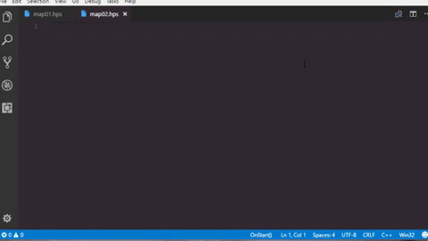
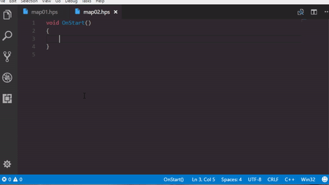

# About HPL2-VSCode-Syntax
Amnesia: The Dark Descent (HPL2) script function signatures auto-completion.
This Visual Studio Code plugin provides snippets for all of the available function signatures in the scripting language for the HPL2 engine commonly used to create Amnesia: The Dark Descent modifications.

- Predefined function completion

- Script function completion

